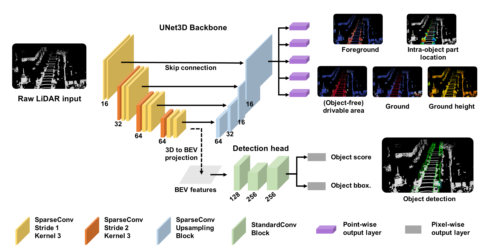

# [A Simple and Efficient Multi-task Network for 3D Object Detection and Road Understanding](https://arxiv.org/pdf/2103.04056.pdf)
by Di Feng, Yiyang Zhou, Chenfeng Xu, Masayoshi Tomizuka, and Wei Zhan

This repository is the official code release of `LidarMTL`, a multi-task network that jointly perform six perception tasks for 3D object detection and road understanding. The code is implemented in Pytorch and based on [`OpenPCDet`](https://github.com/open-mmlab/OpenPCDet). All experiments were conducted using the [`Argoverse Dataset`](https://www.argoverse.org/data.html#tracking-link).

LidarMTL performs 3D object detection, foreground classification, intra-object part location regression, drivable area classification, ground classification, and ground height estimation. The network architecture of the LidarMTL can be found below:




## Installation
All the codes are tested on Ubuntu 16.04, Python 3.6, PyTorch 1.7, CUDA 11.2. The proposed method is based on 3D sparse convolution and deconvolution. Please install the SparseConv library from [`[spconv v1.2]`](https://github.com/traveller59/spconv). 

After git clone this respository, run:
```
pip install -r requirements.txt 
python setup.py develop
```
## Data Preparation
The network is tested on the [`Argoverse Dataset`](https://www.argoverse.org/data.html#tracking-link), which is converted into the KITTI format. Use the [`argoverse-kitti-adapter`](https://github.com/frankfengdi/argoverse-kitti-adapter) to convert data and store the dataset into the folder /data/arogverse/. The directory should look like this:
```
LidarMTL
└── argoverse <----root_dir
    └── argoverse_dataset_lidar_augmented_kitti_format <----data_dir
        └── training
    		└── calib
    		└── velodyne
    		└── image_2
    		└── label_2
    		└── ego_vehicle_pose <-----optional
    		└── ego_vehicle_ground_height <-----optional
		└── ImageSets <-----data split
		└── statistics <-----data distribution
```
Then run:
```
python -m pcdet.datasets.kitti.argoverse_dataset_lidar_augmented_kitti_format create_kitti_infos tools/cfgs/dataset_configs/argoverse_dataset_lidar_augmented_kitti_format.yaml
```

## Training
```
python tools/train.py --cfg_file PATH_TO_CONFIG_FILE
```
## Evaluation
To run inference and evaluate object detection performance:
```
python tools/test.py --cfg_file PATH_TO_CONFIG_FILE --batch_size 1 --ckpt PATH_TO_PRETRAINED_MODEL
```

To evaluate point-wise prediction: First, run inference by setting `SAVE_POINT_PREDICTION` in the config.yaml file to `True`. All predictions will be saved to the folder `argoverse_results`. Then run:
```
python toos/quick_eval_points.py
```
## Pre-trained model
We provide a pre-trained LidarMTL model [`here`](https://drive.google.com/drive/folders/1nUPPGGZ3Opl-scK93YJxKREX2Scpj4p1?usp=sharing)

## License
`LidarMTL` is released under the [Apache 2.0 license](LICENSE).

## Acknowledgement
We would like to thank `OpenPCDet`, an open source project for LiDAR-based 3D scene perception that supports multiple LiDAR-based perception models 

## Citation 
If you find this project useful in your research, please consider to cite:
```
@article{feng2021simple,
  title={A Simple and Efficient Multi-task Network for 3D Object Detection and Road Understanding},
  author={Feng, Di and and Zhou, Yiyang and Xu, Chenfeng and Tomizuka, Masayoshi and Zhan, Wei},
  journal={arXiv preprint arXiv:2103.04056},
  year={2021}
}
```
